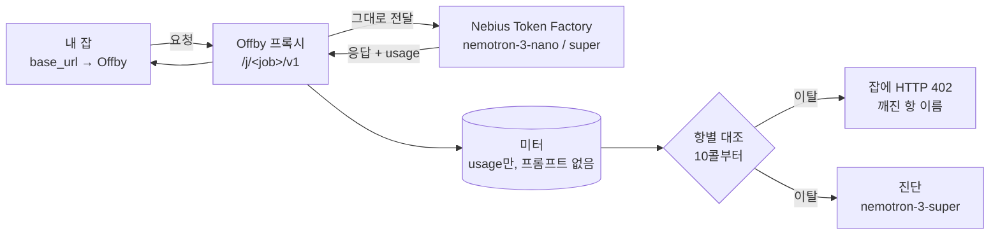

# Offby

[](README.md) [](docs/README.en.md)

**LLM 배치 잡의 예보 심판.**

돌리기 전에 "얼마나 쓸지"를 적어둔다. Offby는 그 잡을 지켜보다가 숫자가 예보와 어긋나는 순간 — 예산이 다 나간 뒤가 아니라 **열 번째 호출쯤에서** — 잡을 세우고 **어느 가정이 틀렸는지** 이름을 붙여 돌려준다.

> **상태: PoC 동작 (모의 업스트림 기준).** Token Factory 실측 전. [Nebius × NVIDIA Global AI Hackathon](https://nebiusglobalaihackathon.devpost.com/) 출품, 제출 마감 2026-10-30. 로드맵 체크박스가 켜지기 전엔 아무것도 배송된 게 아니다.

> *English readers: use the button above or open [docs/README.en.md](docs/README.en.md).*
> 지금 실제로 뭐가 있고 뭐가 검증됐는지는 [docs/STATUS.md](docs/STATUS.md). 누구에게 무슨 쓸모인지(개인·에이전트·게이트웨이 팀·Nebius·API SaaS)는 [docs/USE-CASES.md](docs/USE-CASES.md).

---

## 30초 요약

택시를 탈 때 "2만 원쯤 나오죠?"라고 말했다고 하자. 미터기가 3km 지점에서 *"지금 페이스면 9만 원입니다. 예상과 다른 건 거리가 아니라 **톨게이트 요금**이에요"*라고 말하고 차를 세운다. 그게 Offby다.

예산 캡은 돈을 센다. 돈은 가장 늦게 움직이는 숫자다.

슬랙에 이렇게 썼다: *"오늘 밤 nemotron-nano로 20만 행 분류, 짧은 프롬프트, 문단 답변, 20달러 안."* 출력은 콜당 ~250토큰이라고 가정한 셈이다. 모델이 답하기 전에 생각(reasoning)을 하니 실제로는 ~2,150 — 가정의 8.6배.

| | 멈추는 콜 | 나간 돈 | 알게 되는 것 |
|---|---|---|---|
| 예산 캡, 가격표에 없는 모델 | 안 멈춤 (200,000) | ~$107 | 없음 — 비용이 기록되지 않음(`None`/$0) |
| 예산 캡, 단가 등록, 캡 = $20 | ~37,000 | $20 | "Current cost: 20.0, Max budget: 20" |
| **Offby** | **10** | **~$0.01** | "`output_tokens` 예보의 8.6배 · completion 토큰의 87%가 reasoning · `enable_thinking: false`면 투영 $18.9" |

수치는 예시. 단가는 Nebius Token Factory에 게시된 Nemotron-3-Nano 기준.

**Offby는 지출을 줄이는 도구가 아니라 배치가 계획대로 끝나게 하는 도구다.** 위 시나리오에서 고친 run도 $18.7을 쓴다 — 그 돈은 폭주 → 중간에 죽임 → 환불 요청 → 다음 배치는 다른 곳으로, 가 됐을 돈이다. 벤더들이 캡을 직접 만드는 이유(OpenAI 2026-07 "가장 많이 요청받은 기능", Google 2026-03, Cloudflare 2026-06)와 같다: 예측 가능해야 배치를 올린다.

**Token Factory 현황 (2026-09-09 조사):** 지출 캡 없음(`billing threshold`는 자동 결제 트리거, [billing](https://docs.tokenfactory.nebius.com/other-capabilities/billing-new.md)) · 알림 없음 · 키별 usage는 [아이디어 보드](https://ideas.nebius.com/p/usage-per-api-key-in-ai-studio)에 1년 넘게 "In Review" · [관측 페이지](https://docs.tokenfactory.nebius.com/ai-models-inference/observability.md)가 스스로 "billing reconciliation용 아님" · [레이트리밋](https://docs.tokenfactory.nebius.com/ai-models-inference/rate-limits.md)은 15분마다 +20%씩 자동 상향. Token Factory 유저에게 Offby는 더 정밀한 층이 아니라 유일한 층이고, 그래서 키별 캡 기능 요청을 같이 낸다.

## 어떻게 쓰나 — 입구 셋

**1. 에이전트 스킬 (권장).** 배치 코드를 쓰는 건 이제 대개 에이전트다. [`skills/offby/SKILL.md`](skills/offby/SKILL.md)를 Claude Code 같은 하네스에 넣어두면, 에이전트가 LLM 루프를 돌리기 직전에 스킬이 발동해서 **코드에서 예보를 뽑고 → 잡을 등록하고 → 프록시로 돌리고 → 402가 나면 진단을 읽고 코드를 고쳐 재실행**한다. 사람은 예보를 안 쓴다. 에이전트가 자기 코드에서 N·프롬프트 길이·모델 id를 읽으니 문장으로 추측하는 것보다 정확하다.

**2. CLI 직접.** 이름 붙은 잡을 만들고 URL을 받는다.
```bash
offby job ensure nightly-classify --calls 200000 --input 400 --output 250 --model nvidia/nemotron-3-nano-30b-a3b --budget 20
OPENAI_BASE_URL=http://localhost:8402/j/nightly-classify/v1 python classify.py
```
문장으로 쓰고 싶으면 `offby forecast "오늘 밤 20만 행 분류, 짧은 프롬프트, 문단 답변, 20달러 안"` — nano가 5항으로 옮기고, 문장에 없던 항은 `ASSUMED`로 표시해 집행 전에 확인받는다.

**3. cron / 컨테이너.** 잡 옆에 프록시를 사이드카로 두고, 실행 줄에 URL 한 줄. 같은 이름으로 다시 오면 새 run이다.

세 입구 모두 잡 쪽 변경은 **환경변수 한 줄**뿐이다. SDK도, 코드 수정도, 키 발급도 없다. 잡의 API 키는 그대로 통과한다.

## 동작



1. **예보 → 다섯 항.** `호출수 · 입력 tok/콜 · 출력 tok/콜 · 단가 · 창`. 단가는 `GET /v1/models?verbose=true`에서 라이브로 읽고, 모르는 모델은 `UNPRICED`로 맨 위에 뜬다 — 절대 $0이 아니다.
2. **잡을 Offby로.** `OPENAI_BASE_URL` 한 줄. 요청 본문은 손대지 않고 전달한다.
3. **유효 콜 10개부터 심판.** 응답마다 붙어오는 `usage`를 읽어 항마다 실측 ÷ 예보의 비율을 쌓는다. 판정창 전체 **또는** 최근 30콜의 평균 비율이 임계(기본 2배)를 **t > 2.5의 확신으로** 넘을 때만 이탈 — 실제 출력 길이는 꼬리가 긴데(p95가 중앙값의 3.6배), 긴 답 하나로는 잡이 죽지 않는다(시뮬레이션 0%). 에러 응답과 usage 없는 응답은 평균에 들어가지 않고 따로 센다. 이탈하면 그 다음 요청부터 진짜 에러가 나간다:

```http
HTTP/1.1 402 Payment Required
X-Offby-Halt: output_tokens
X-Offby-Diagnosis: http://localhost:8402/j/nightly-classify/diagnosis

{"error":{"type":"offby_term_breach","term":"output_tokens","ratio":8.6,
 "message":"offby_term_breach: term output_tokens breached 8.6x (250→2150, t=4.1) — halted at 25/200,000 (judged at 10, 15 were in flight); projected $103.20 vs $16.80",
 "resume":"offby accept nightly-classify output_tokens=2150","errors":{"429":2},"unmetered":0}}
```

4. **진단은 이탈 때만.** `nemotron-3-super`가 증거 묶음(reasoning 토큰 비중, 재시도·429, 캐시 비중, 언급한 적 없는 모델)을 읽고 **원인 · 최상위 unknown · 수정안**을 돌려준다. 원인을 고쳐 재실행하거나(`offby accept <job>`), 새 숫자를 받아들인다(`offby accept <job> output_tokens=2200`).

**hot path에 모델 호출은 0.** 모델은 잡당 두 번만 — 문장 파싱 한 번(문장을 썼을 때만), 이탈마다 진단 한 번.

심판 규칙의 검증 수치(실제 출력 분포를 흉내 낸 lognormal 시뮬레이션, `judge.py` 직접 호출): 건강한 잡 오탐 **0%**(스파이크 2%까지), 예보를 평균으로 잡았을 때도 0%, 4,000토큰 답 하나가 n=10~30 어디에 와도 **0%**; 8배 폭주는 10콜, **1,000콜 건강 뒤 8배 급변은 11콜**(전체평균 규칙은 286콜), 2.5배는 24콜, 30%가 10배인 bimodal은 33콜, 1→3배 드리프트는 128콜에 잡힘.

## 용어 — job, call, run

- **call** = HTTP 요청 하나. `calls` 테이블 한 줄.
- **job** = 같은 URL(`/j/<이름>/v1`)로 들어온 call의 묶음. 예보 하나를 공유한다. 실체는 SQLite 한 줄과 URL 경로뿐이다 — 프로세스도 큐도 아니다.
- **run** = `offby job ensure <이름>`을 다시 부를 때마다 시작되는 실행 1회. 카운터·판정·상태는 리셋되고 이력은 남는다.
- **잡은 Offby를 모른다.** 잡이 만지는 건 base_url뿐이다. 프록시는 잡의 프로세스를 죽일 권한이 없다 — 402를 돌려주면 SDK가 예외를 던지고 잡이 그 예외로 멈춘다. 멈추지 않고 계속 부르면 계속 402를 받는데, halted 상태에선 업스트림에 가지 않으니 돈은 나가지 않는다.

## 언제 맞고 언제 안 맞나

핵심 가정은 하나다: **콜당 입력·출력 토큰이 대충 일정하다.** 이게 성립해야 "콜당 평균 대비 배수"가 의미 있다.

| 상황 | 맞나 | 이유 |
|---|---|---|
| 리뷰 20만 건 분류, 야간 임베딩, eval 스윕, 문서 OCR 배치, 합성데이터 생성 | **맞음** | 같은 템플릿 × N행 |
| cron으로 매일 도는 에이전트 루틴 | **맞음** | 같은 이름으로 다시 오면 새 run. 이력이 예보가 된다 (로드맵) |
| 티켓 5,000개를 같은 방식으로 처리하는 에이전트 플릿 | **맞음** | 반복 모양 |
| ReAct류 에이전트 루프 1회 | 애매함 | 콜 수 불명, 컨텍스트가 매 턴 커져 `input_tokens`가 자연히 몇 배가 됨. `--baseline`으로 "급변"만 |
| 사람이 보고 있는 인터랙티브 세션, 챗봇 서빙 트래픽 | **안 맞음** | 예보도 모양도 끝도 없다. 사람이 이미 루프 안에 있다. 이건 게이트웨이의 키별 예산 영역 |
| `stream_options.include_usage`를 무시하는 업스트림 | **부분** | 스트림 텍스트로 토큰을 추정해(표시함) 판정하고, usage가 다섯 번 연속 없으면 `X-Offby-Halt: usage`로 멈춘다 — 조용히 통과시키지 않는다 |

Offby는 **아무도 안 보고 있는 실행**을 위한 것이다. 사람이 보고 있는 실행에 끼우면 심판이 아니라 방해다.

## 시나리오 — 잡 하나를 끝까지

**22:10** 데이터팀의 A: *"오늘 밤 리뷰 20만 건을 nemotron-nano로 분류할게요. 프롬프트 짧고, 답은 한 문단, 20달러 안일 거예요."*

**22:11** 그 문장을 그대로 넣는다.

```
$ offby forecast "오늘 밤 리뷰 20만 건을 nemotron-nano로 분류. 프롬프트 짧고, 답은 한 문단, 20달러 안" --budget 20

  항              예보        출처
  호출수          200,000     문장
  입력 tok/콜     400         ASSUMED ← "프롬프트 짧고"
  출력 tok/콜     250         ASSUMED ← "답은 한 문단"
  단가 $/M        0.06 / 0.24 token factory (live)
  창              오늘 밤     문장
  예상 총액       $16.80      (< $20 ✓)

  ASSUMED 2건은 Offby가 추측한 값입니다. 맞으면 Enter, 아니면 고치세요:  ↵
  job j_7f3a 생성. base_url → http://localhost:8402/j/j_7f3a/v1
```

**22:12** 환경변수 한 줄 붙여 실행. `OPENAI_BASE_URL=http://localhost:8402/j/j_7f3a/v1 python classify.py`

**22:12:40** 유효 콜 열 개가 쌓였다. 출력 평균 2,137 ÷ 예보 250 = **8.5배**, 그것도 흔들림 없이(t = 4.1 > 2.5) → 이탈. 호출수·입력·단가는 계획대로. 깨진 항은 `output_tokens` 하나. 지금까지 $0.005, 이대로면 **$107.6**.

**22:13** 다음 요청에 402. A의 터미널:

```
openai.APIStatusError: 402 offby: offby_term_breach: term output_tokens breached 8.6x (250→2150, t=4.1)
  — halted at 25/200,000 (judged at 10, 15 were in flight); projected $107.60 vs $16.80
  resume: offby accept j_7f3a output_tokens=2150   diagnosis: http://localhost:8402/j/j_7f3a/diagnosis
```

**22:13** 진단(`nemotron-3-super`):

> 깨진 항: **출력**. completion 토큰의 87%가 reasoning. `nemotron-3-nano`는 기본이 think-on — 문단 하나를 값 매겼는데 사고 과정 + 문단이 청구됐다. **수정**: `chat_template_kwargs.enable_thinking=false` → 출력 ~290/콜, 투영 **$18.9**.

**22:15** 옵션을 넣고 `offby accept j_7f3a` 후 재실행. 60콜부터 초록. 새벽 3시에 끝났고 청구는 $18.7.

**같은 밤, Offby가 없었다면** — 캡 없음: 아침에 $107 청구서. LiteLLM 키에 `max_budget=20`: 새벽 1시 37,000번째 콜에서 정지, 19%만 처리, $20은 사라짐, 같은 설정으로 다시 돌리면 같은 일. 팀 공용 키에 캡: A의 잡이 팀 전체 예산을 소진해 남의 요청까지 거부.

### 예보 없이 — 베이스라인 모드

`offby job ensure <이름> --baseline 10`. 첫 10콜을 기준으로 삼고 그 뒤 급변(항별 2배)만 잡는다. "네 기대와 다르다"는 못 말하지만 "50콜부터 출력이 3배 뛰었다"는 잡힌다.

## 지금 돌려보기 (PoC)

키 없이, 돈 안 쓰고, 위 시나리오를 재현한다. 모의 업스트림이 Nemotron처럼 **think-on 기본**으로 답하고, 기본값부터 현실을 닮았다: 출력 길이는 lognormal(σ 0.8), 콜당 지연 1초±50%, `max_tokens`를 넘으면 잘라서 `finish_reason: length`. `--profile hostile`이면 429/500 10%, reasoning이 `reasoning_content`로, 모델 id는 canonical로, 가격은 토큰당 문자열로 온다. 모델 id는 `mock/`으로 시작해 `lessons`가 실측과 섞지 않는다. 빨리 보려면 `--latency-ms 0`.

```bash
uv sync                                                              # Python 3.12, .venv
uv run offby mock  --port 8499                                       # 터미널 1: 가짜 Token Factory
uv run offby serve --port 8402 --upstream http://127.0.0.1:8499/v1   # 터미널 2: 프록시
```

터미널 3 — `examples/reviews.jsonl`(120행)을 분류하는 샘플 잡:

```bash
uv run offby job ensure classify-reviews --calls 120 --input 40 --output 250 \
  --model nvidia/nemotron-3-nano-30b-a3b --budget 1 --upstream http://127.0.0.1:8499/v1 -y
#   expected total $0.01 · base_url → http://localhost:8402/j/classify-reviews/v1

OPENAI_BASE_URL=http://localhost:8402/j/classify-reviews/v1 uv run python examples/classify.py --data examples/reviews.jsonl
#   유효 10콜 뒤: 402 offby: offby_term_breach: term output_tokens breached 8.9x (250→2234, t=4.1)
#              — halted at 10/120; projected $0.0646 vs $0.0075     (숫자는 매번 조금 다르다 — 꼬리가 긴 분포니까)

uv run offby report classify-reviews       # 항별 표 · 증거(reasoning 87%) · 진단 · resume 명령
uv run offby accept classify-reviews       # 원인을 고쳤다 → 다음 콜부터 다시 판정
OPENAI_BASE_URL=http://localhost:8402/j/classify-reviews/v1 uv run python examples/classify.py --data examples/reviews.jsonl --no-think
#   enable_thinking=false → 출력 ≈290 → 120/120 통과

uv run offby lessons                       # 이 모델은 thinking이 출력을 ≈7배로 만든다 — 다음 예보에 쓸 것
uv run offby job ensure classify-reviews -y   # 내일: 같은 이름 = 새 run, 예보 유지
```

문장 예보도 mock 상대로 돌아간다(mock이 파싱 프롬프트에 답한다): `uv run offby forecast "classify 120 reviews tonight on nemotron-nano, short prompts, paragraph answers, under $1" --budget 1 --upstream http://127.0.0.1:8499/v1 --api-key mock`. 적대적 조건은 `uv run offby mock --port 8499 --profile hostile`로 띄우고 같은 흐름을 다시 — `report`에 `failed calls: 4 (429)`, `reasoning share 87% (estimated)` 같은 줄이 붙는다.

에이전트 스킬로 같은 흐름을 돌리려면 `skills/offby/SKILL.md`를 하네스의 스킬 폴더에 두면 된다(Claude Code: `.claude/skills/offby`). 실제 Token Factory로 가려면 `NEBIUS_API_KEY`를 두고 `--upstream`을 뺀다. 기록은 `~/.offby/offby.sqlite`(또는 `$OFFBY_DB`)에 usage만 남는다.

**있는 것** — 프록시(비스트리밍·스트리밍, chat/completions·completions·embeddings·responses 계측) · usage 미터(SQLite, `finish_reason` 포함) · 가격 오라클(`/v1/models` 응답을 단위표로 읽고 `"0"`·부재·모호한 꼬리는 `UNPRICED`) · 이탈 엔진(유효 10콜 · 2배 · t>2.5, 판정창 전체 OR 최근 30콜) · 에러/usage 없음/추정 분리 집계 · usage 5연속 없음 → `X-Offby-Halt: usage` · 402 본문/헤더(`X-Should-Retry: false`) · 이름 붙은 잡과 run(`job ensure`) · `accept` / `report` / `lessons` / `jobs` · 베이스라인 모드(중앙값) · nano 예보 파싱 · super 진단(빈 응답은 `unavailable`) · 현실적 모의 업스트림(꼬리·지연·에러·reasoning 4형태·가격 4형태·`--profile hostile`) · 에이전트 스킬 · 테스트 43개.
**아직 없는 것** — Token Factory 실측(정본 모델 id, `reasoning_tokens`가 채워지는지, thinking을 끄는 플래그, verbose 가격 응답의 실제 모양) · `alert` 모드(402 없이 웹훅/로그만) · 웹훅 · sticky halt와 예산 강제(`job ensure`로 halt를 우회할 수 있음) · O(1) 심판(지금은 콜마다 run 전체를 다시 계산) · 다중 프록시 안전 · HTTP 컨트롤 플레인 · 이력 기반 자동 예보 · 진단 스트리밍 · UI · LiteLLM 플러그인.

## 모델은 어디서 무게를 받나

| | 역할 | 왜 이 모델 |
|---|---|---|
| `nvidia/nemotron-3-nano-30b` | 캐주얼한 문장을 `ASSUMED` 배지 달린 다섯 항으로(구조화 출력) | 싸고 빠르고, 자연어가 불가피한 유일한 단계 |
| `nvidia/nemotron-3-super-120b` | 증거 묶음에서 이탈 원인 진단 + 수정 예보 | 콜마다가 아니라 이탈마다 한 번 |
| Nebius Token Factory | 라이브 단가, reasoning·캐시 토큰이 든 `usage`, rate-limit 헤더 | 측정 표면이 곧 스폰서 API |

Nemotron 3에는 생각을 켜고 끄는 손잡이가 있다(`enable_thinking`, reasoning budget 제어) — 그래서 같은 프롬프트가 3~4배 싸질 수 있다. Offby는 그 손잡이를 잊었을 때 첫 10여 콜에서 알려주는 도구이고, `lessons`가 남기는 "이 모델은 thinking이 출력을 4.3배로 만든다"는 숫자는 모델을 잘 쓰는 법이지 모델을 탓하는 말이 아니다. 데모의 오버런은 연출이 아니라 측정이다.

**첫 실측 (2026-09-09, 로컬 `nemotron-3-nano:4b` Q4 via Ollama, 리뷰 120건 분류, 비용 $0):** 공식 chat template의 `enable_thinking` 기본값은 True. think-on일 때 completion 중앙값 144 · 평균 217 · p95 559 · max 848 (reasoning 비중 85%, lognormal σ≈0.6), think-off(`reasoning_effort: none`)면 67 → **배수 3.2×(평균)**. 위 표의 "8.6배"는 30B·긴 답변 가정의 예시이고, 실제 배수는 모델·프롬프트에 달렸다. Ollama는 usage에 `reasoning_tokens`를 주지 않아 `reasoning` 필드로 추정했고, `chat_template_kwargs`는 무시하고 `reasoning_effort`만 읽는다 — 끄는 플래그는 서버마다 다르다. 같은 4B로 출력을 60으로 잘못 예보한 run은 **4.7×를 42콜에서** 세웠다(꼬리가 긴 분포에서 t > 2.5 확신을 얻는 데 든 콜 수; 그때까지 $0.003). 4B는 진단(reasoning 88%를 못 보고 지연 탓을 함)과 문장 파싱(120건을 1건으로)에는 부족했다.

**같은 날, 로컬 `nemotron-3-nano:30b` (Q4, 24GB, ~50 tok/s):** think-on 중앙값 205 · 평균 404 · p95 2,092 · max 4,000(캡) — 4B보다 꼬리가 훨씬 길다(σ≈0.9). 예보 250 대비 1.6배라 **멈추지 않음(옳음)**. think-off 89 → **배수 4.3×(평균)**. 출력 60 오예보는 **11콜에서 402** (3.1×, t=2.6, 지출 $0.0006). 30B는 **문장 파싱 5항을 전부 정확히** 뽑았고(4B는 실패), 진단은 evidence에 산술로 뽑은 `hypotheses`를 넣어주자 "reasoning 96%가 출력으로 청구됨 → `reasoning_effort='none'`"을 정확히 짚었다(넣기 전엔 예보를 되풀이함). Token Factory의 30B 실측은 아직.

## 왜 예산 캡만으로 안 되나

예산 캡은 있어야 한다. Offby는 캡을 대체하지 않는다 — **옆에 선다.** 캡이 스프링클러라면 Offby는 연기 감지기다.

런 단위 달러 천장은 이미 있다 — [Cloudflare AI Gateway spend limits](https://developers.cloudflare.com/ai-gateway/features/spend-limits/)(2026-06, metadata로 잡 분리, 429), [LiteLLM `max_budget_per_session`](https://docs.litellm.ai/docs/a2a_iteration_budgets)(429), [OpenRouter](https://openrouter.ai/docs/api_reference/limits)·[Vercel](https://vercel.com/changelog/budgets-for-api-keys-on-ai-gateway) 키별 한도. Offby는 그 위에 얹히는 층이다.

| | 게이트웨이 천장 (Cloudflare · LiteLLM 세션 · 키별 한도) | Offby |
|---|---|---|
| 기준 | 운영자가 정한 달러 상한 — 예상 비용 이상으로 잡아야 하므로 **의도한 지출의 ~100%를 쓴 뒤** 멈춤 | **네 예보** 대비 비율, 항별 — 실측에서 런의 8~35%(11~42콜)에서 멈춤 |
| 에러가 말하는 것 | "Current cost: 20.0, Max budget: 20" | `output_tokens 3.1x (60→185, t=2.6)` + 진단 |
| 가격표에 없는 모델 | 비용 `None`/$0 → 천장이 울리지 않음 | `UNPRICED`로 첫 줄에 표시, 토큰 항은 그대로 판정 |
| 정체성 | 키 (누가 썼나) | URL 경로 (이 실행이 예보대로 가나) |
| 저장하는 것 | 지출·요청 로그 | `usage`만 — 프롬프트·응답 절대 저장 안 함 |

정직한 갭: 종류는 다르지만 코드는 작다 — LiteLLM은 훅·세션 카운터·투영 함수를 이미 갖고 있어서 이 층은 CustomLogger 하나로 들어간다. 그래서 로드맵의 플러그인 모드가 3주차다.

2026-09-06 LiteLLM 문서·소스 확인: 예산 집행은 누적 지출의 선호출 검사, 초과 메시지는 엔티티·현재 비용·한도만 말함, 번들 가격표에 Nemotron 3 항목이 없어 단가를 직접 넣지 않으면 비용이 `None`으로 기록됨. 2026-09-09 시장 조사(제공사 12곳·게이트웨이 10곳·배치 플랫폼·FinOps): 런 예보를 받아 항별로 검정하고 원인을 이름 붙이는 곳은 없었고, Token Factory에는 캡·알림 자체가 없었다.

## 설계 규칙

- **usage만.** 미터는 토큰 수·모델 id·상태·지연·rate-limit 헤더를 저장한다. 프롬프트와 응답은 컬럼 자체가 없다.
- **$0 금지.** 가격 없는 모델은 `UNPRICED`로 첫 줄에 뜬다. 조용히 0이 되지 않는다.
- **가정은 보이게, 확인받고 집행.** 미기재 항마다 `ASSUMED`와 근거 문구가 붙는다.
- **유효 콜 10개 전엔 판정 없음, 넘어도 확신이 있어야 한다.** 평균 비율이 임계를 넘는 것만으론 부족하고 t > 2.5(판정창 전체 또는 최근 30콜)여야 한다. 실제 출력은 꼬리가 길어서, 평균만 보던 규칙은 건강한 잡의 36~49%를 죽였다. 롱테일 답 하나로는 어느 시점에도 정지하지 않는다.
- **에러와 usage 없음은 콜이 아니다.** 429/5xx는 평균에도 `calls` 항에도 들어가지 않고 `failed calls`로 따로 센다. 2xx인데 usage가 없으면 스트림 텍스트로 추정해 표시하고, 다섯 번 연속이면 `usage` 항으로 멈춘다 — 심판이 볼 수 없는 업스트림은 조용히 통과시키지 않는다.
- **재개하면 판정 창을 리셋한다.** `accept` 뒤에는 그 이후 콜만 본다. 안 그러면 고친 뒤에도 오염된 평균 때문에 첫 콜에서 다시 멈춘다. 총액·투영은 run 전체로 센다.
- **402는 이탈을 만든 콜의 *다음* 요청부터.** 이미 돈이 나간 응답은 그대로 돌려준다. 동시성만큼 더 나가며, 402 메시지가 "judged at 10, 7 were in flight"로 그 차이를 말한다.
- **Offby의 402는 업스트림의 402가 아니다.** Token Factory는 *네* 잔액이 소진되면 402를 낸다. Offby의 402는 `type: offby_term_breach`와 `X-Offby-Halt`를 달아 절대 섞이지 않는다.
- **원하면 fail-open.** `--fail-open`이면 미터가 죽어도 트래픽을 통과시킨다. 심판이 건강한 잡을 죽이는 물건이어선 안 된다.
- **reasoning 토큰은 관측 전엔 미지수.** `completion_tokens_details`가 null이면 `reasoning_content`나 `<think>` 태그로 추정하고 추정이라 표시한다.

## CLI

```bash
offby serve    --upstream https://api.tokenfactory.nebius.com/v1 [--fail-open]   # 프록시
offby mock     --port 8499 [--profile hostile] [--latency-ms 0] [--tail-on 0.8]    # 가짜 업스트림 (PoC)
offby job ensure <name> --calls N --input I --output O --model <id> --budget B     # 이름 붙은 잡 · 다시 부르면 새 run
offby job ensure <name> --baseline 10                                             # 예보 없이
offby forecast "200k-row classification tonight on nemotron-nano, …" --budget 20  # 1회용 잡, 문장 파싱
offby report   <name>                                                             # 항별 예보 vs 관측, 비용, 진단
offby accept   <name> [output_tokens=2200]                                        # 항 수용 또는 원인 고친 뒤 재개
offby lessons                                                                     # 잡 횡단 교훈 — 다음 예보 전에 읽을 것
offby jobs
```

## 로드맵

- [x] **1주** — 프록시 + 미터 + 가격 오라클 E2E (모의 업스트림)
- [ ] **1주** — Token Factory day-1 측정(정본 모델 id, `reasoning_tokens` 채워지는지, 어떤 플래그가 thinking을 끄는지, nano에서 `json_schema`가 버티는지)
- [x] **2주** — 이탈 엔진, 402 본문, `accept`, CLI, report
- [x] **2주+** — 이름 붙은 잡과 run, `lessons`, 에이전트 스킬
- [x] **2주+ (9/9 감사 반영)** — 유효 콜만 판정 · t-검정 규칙 · usage 없음 이벤트 · 가격 정직화 · embeddings 계측 · 현실적 mock 기본값과 `hostile` 프로파일
- [ ] **3주** — `alert` 모드 + 웹훅, **LiteLLM 플러그인 모드(CustomLogger)**, sticky halt와 예산 항, Nebius 기능 요청(키별 캡·usage의 `reasoning_tokens`) 제출
- [ ] **4주** — Token Factory 실측(≥$50 run, super think-on vs off, "같은 run에 $20 캡이었다면"), O(1) 심판과 단일 writer 락, HTTP 컨트롤 플레인
- [ ] **5주** — 이력 기반 자동 예보, 진단 스트리밍, 호스팅 데모는 최소형(tour mode만). 단일 페이지 UI는 보류 — 흡수된 경쟁자들이 전부 가졌던 것
- [ ] **6주** — 클린 클론에서 README 검증, 3분 영상, 툴링 피드백
- [ ] **10/28 제출**

## 의도적으로 안 만드는 것

응답 중간 스트림 절단(판정은 요청 경계에서) · 멀티프로세스/Redis 카운터 · 사용자 계정·키 발급 · Batch API·캐시 할인 회계(증거로 기록만) · 프롬프트 저장·재실행 큐 · 프론트엔드 빌드 단계 · OpenAI 호환 외 업스트림 · 자동 `accept`.

## 해커톤

트랙: **Best Apps and Agents**. 이 레포가 충족할 요건: Nebius Token Factory 런타임 호출 · NVIDIA Nemotron 3 모델이 load-bearing(파싱 + 진단) · Apache-2.0 공개 레포 · 호스팅 데모 URL · 3분 미만 영상 · 툴링 피드백.

서사는 "청구서를 깎아준다"가 아니다. **Token Factory에 없는 층을 Token Factory를 위해 만들었다** — 무인 배치가 계획대로 끝나게 하는 심판, Nemotron의 thinking 손잡이를 잊었을 때 첫 10콜에서 알려주는 도구, 그리고 키별 캡 기능 요청 동봉. 영상의 데모는 `alert` 모드로: "10콜에서 '출력이 4배, thinking 켜져 있음'이라고 알려줬고, 사용자가 끄고 완주했다."

## 라이선스

Apache-2.0. [LICENSE](LICENSE) 참조.
