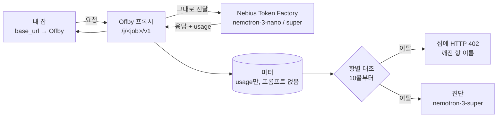

# Offby

[](README.md) [](docs/README.en.md)

**LLM 배치 잡의 예보 심판.**

돌리기 전에 한 문장으로 예상을 적는다. Offby는 그 문장을 측정 가능한 항 다섯 개로 바꾸고, OpenAI 호환 프록시로 잡을 지켜보다가, 숫자가 네 말과 어긋나면 **열 번째 호출쯤에서 잡을 세우고 어느 가정이 틀렸는지 이름을 붙여** 돌려준다. 예산이 다 나간 뒤가 아니라.

> **상태: 설계 → 구현.** [Nebius × NVIDIA Global AI Hackathon](https://nebiusglobalaihackathon.devpost.com/) 출품(제출 마감 2026-10-30). 이 README가 계약이고 코드는 매주 붙는다. 아래 로드맵 체크박스가 켜지기 전엔 아무것도 배송된 게 아니다.

> *English readers: use the button above or open [docs/README.en.md](docs/README.en.md).*

---

## 문제를 표 하나로

예산 캡은 돈을 센다. 돈은 가장 늦게 움직이는 숫자다.

슬랙에 이렇게 썼다: *"오늘 밤 nemotron-nano로 20만 행 분류, 짧은 프롬프트, 문단 답변, 20달러 안."* 출력은 콜당 ~250토큰이라고 가정한 셈이다. 모델이 답하기 전에 추론(reasoning)을 하니 실제로는 ~2,150 — 가정의 8.6배.

| | 멈추는 콜 | 나간 돈 | 알게 되는 것 |
|---|---|---|---|
| 예산 캡, 가격표에 없는 모델 | 안 멈춤 (200,000) | ~$107 | 없음 — 비용이 $0로 기록됨 |
| 예산 캡, 단가 등록, 캡 = $20 | ~37,000 | $20 | "Current cost: 20.0, Max budget: 20" |
| **Offby** | **10** (25에서 정지) | **~$0.01** | "`output_tokens` 예보의 8.6배 · completion 토큰의 87%가 reasoning · 기본이 think-on → `enable_thinking: false`면 투영 $18.9" |

수치는 예시. 단가는 Nebius Token Factory에 게시된 Nemotron-3-Nano 기준. → [왜 예산 캡만으로 안 되나](#왜-예산-캡만으로-안-되나)

## 동작



**1. 한 문장 → 다섯 항.** `nemotron-3-nano-30b`가 예보를 `호출수 · 입력 tok/콜 · 출력 tok/콜 · 단가 · 창`으로 파싱한다. 문장에 없던 항은 `ASSUMED` 배지. Token Factory 모델 단가는 `GET /v1/models?verbose=true`에서 라이브로 가져오고, 가격을 모르는 모델은 `UNPRICED`로 최상단에 뜬다 — 절대 $0이 아니다. **집행 전에 다섯 항을 확인받는다.**

```json
{"job":"j_7f3a","budget_usd":20,
 "terms":{
  "calls":         {"value":200000,"source":"stated"},
  "input_tokens":  {"value":400,   "source":"assumed","why":"short prompts"},
  "output_tokens": {"value":250,   "source":"assumed","why":"paragraph answers"},
  "price":         {"in_per_m":0.06,"out_per_m":0.24,"source":"oracle"},
  "window":        {"end":"tonight","source":"stated"}}}
```

**2. 잡을 Offby로 향하게.** 환경변수 한 줄. SDK도 코드 수정도 없다.

```bash
OPENAI_BASE_URL=http://localhost:8402/j/j_7f3a/v1 python classify.py
```

**3. 10콜부터 심판.** 항마다 관측률을 예보와 대조하고 총액을 투영한다. **전체 평균과 최근 5콜 평균이 둘 다** 임계(기본 2배)를 넘어야 이탈 — 긴 답 하나로는 잡이 죽지 않는다. 이탈하면 잡은 무시할 수 없는 진짜 에러를 받는다:

```http
HTTP/1.1 402 Payment Required
X-Offby-Halt: output_tokens
X-Offby-Diagnosis: /j/j_7f3a/diagnosis

{"error":{"type":"offby_term_breach","term":"output_tokens","ratio":8.6,
 "message":"term output_tokens breached 8.6x (250→2150) — halted at 25/200000; projected $103.2 vs $12.0",
 "resume":"offby accept j_7f3a output_tokens=2200"}}
```

**4. 진단은 이탈 때만.** `nemotron-3-super-120b`가 증거 묶음 — reasoning 토큰 비중(`usage.completion_tokens_details.reasoning_tokens`), 재시도·429, 캐시 입력 비중, service tier, 언급한 적 없는 모델 — 을 읽고 **메커니즘 · 최상위 unknown-unknown · 수정 예보**를 스트리밍한다. 새 숫자를 `accept`하거나 원인을 고쳐 재실행한다.

## 모델은 어디서 무게를 받나

| | 역할 | 왜 이 모델 |
|---|---|---|
| `nvidia/nemotron-3-nano-30b` | 캐주얼한 문장을 `ASSUMED` 배지 달린 다섯 항으로(구조화 출력) | 싸고 빠르고, 자연어가 불가피한 유일한 단계 |
| `nvidia/nemotron-3-super-120b` | 증거 묶음에서 이탈 원인 진단 + 수정 예보 | 콜마다가 아니라 이탈마다 한 번 |
| Nebius Token Factory | 라이브 단가(`/v1/models?verbose=true`), reasoning·캐시 토큰이 든 `usage`, rate-limit 헤더 | 측정 표면이 곧 스폰서 API |

**hot path에 모델 호출은 0.** 프록시는 모든 응답에 이미 붙어오는 `usage` 객체를 읽을 뿐이다. 모델은 잡당 정확히 두 번 불린다 — 예보 파싱 한 번, 이탈마다 진단 한 번.

## 왜 예산 캡만으로 안 되나

예산 캡은 있어야 한다. Offby는 캡을 대체하지 않는다 — **옆에 선다.**

| | LiteLLM 등 게이트웨이 예산 | Offby |
|---|---|---|
| 감지 단위 | 누적 달러 | **네 예보** 대비 속도, 항별 |
| 가장 빠른 정지 | 예산이 소진될 때(그것도 모델이 가격표에 있을 때만) | 10콜 |
| 에러가 말하는 것 | 현재 지출 vs 한도 | 어느 항이 몇 배 틀렸고 왜인지 |
| 필요한 것 | DB, 잡/팀별 키 | 환경변수 한 줄 |
| 저장하는 것 | 지출 로그 / 요청 로그 | `usage`만 — 프롬프트·응답 절대 저장 안 함 |

2026-09-06 LiteLLM 문서·소스 확인: 예산 집행은 누적 지출의 선호출 검사(최신 버전은 낙관적 예약 포함), 초과 메시지는 엔티티·현재 비용·한도만 말함, 번들 가격표에 Nemotron 3 항목이 없어 단가를 직접 넣지 않으면 비용이 `None`으로 기록됨, `soft_budget` 알럿엔 투영이 있지만 차단은 안 함. Offby의 일은 캡이 구조적으로 못 하는 부분이다: **일찍 멈추고, 어느 가정이 틀렸는지 말하는 것.** 이미 게이트웨이를 운영하는 팀이 두 번째 프록시 없이 심판을 얹을 수 있게 LiteLLM 플러그인 모드(`CustomLogger` pre-call hook)가 로드맵에 있다.

## 설계 규칙

- **usage만.** 미터는 토큰 수·모델 id·상태·지연·재시도·rate-limit 헤더를 저장한다. 프롬프트와 응답은 절대 쓰지 않는다.
- **$0 금지.** 가격 없는 모델은 `UNPRICED`로 첫 줄에 뜬다. 조용히 0이 되지 않는다.
- **가정은 보이게, 확인받고 집행.** 미기재 항마다 `ASSUMED`와 근거 문구가 붙고, 다섯 항을 보여준 뒤에 집행이 시작된다.
- **10콜 전엔 판정 없음, 두 평균이 일치해야 한다.** 롱테일 출력은 정지를 부르지 않는다.
- **Offby의 402는 업스트림의 402가 아니다.** Token Factory는 *네* 잔액이 소진되면 402를 낸다. Offby의 402는 `type: offby_term_breach`와 `X-Offby-Halt`를 달아 둘이 절대 섞이지 않는다.
- **원하면 fail-open.** `--fail-open`이면 미터가 죽어도 트래픽을 통과시킨다. 심판이 건강한 잡을 죽이는 물건이어선 안 된다.
- **reasoning 토큰은 관측 전엔 미지수.** `completion_tokens_details`가 null이면 `reasoning_content`나 `<think>` 태그로 추정하고 추정이라 표시한다. null을 0으로 강제하지 않는다.

## 계획된 CLI

```bash
offby serve   --upstream https://api.tokenfactory.nebius.com/v1     # 프록시
offby forecast "200k-row classification tonight on nemotron-nano, short prompts, paragraph answers, under $20" --budget 20
offby report  j_7f3a                                                 # 항별 예보 vs 관측, 비용, 진단
offby accept  j_7f3a output_tokens=2200                              # 항 하나 수용, 재개
```

## 로드맵

- [ ] **1주** — 프록시 + 미터 + 가격 오라클 E2E; Token Factory day-1 측정(정본 모델 id, `reasoning_tokens` 채워지는지, 어떤 플래그가 thinking을 끄는지, nano에서 `json_schema`가 버티는지)
- [ ] **2주** — 이탈 엔진, 402 본문, `accept`, CLI, report
- [ ] **3주** — 예보 파서 폴백 체인(`json_schema` → `guided_json` → `json_object` + 수리); 진단 스트리밍
- [ ] **4주** — 단일 페이지 UI: 예보 카드, 게이지, 터미널 로그, 진단 패널, 영수증 드로어
- [ ] **5주** — 호스팅 데모: **서로 다른 항이 깨지는** 서버측 프롬프트 세트 3종, 실행 큐, IP당 쿼터, 일일 지출 상한, 정직한 리플레이 폴백
- [ ] **6주** — LiteLLM 플러그인 모드, 클린 클론에서 README 검증, 3분 영상, 툴링 피드백
- [ ] **10/28 제출**

## 의도적으로 안 만드는 것

응답 중간 스트림 절단(판정은 요청 경계에서) · 멀티프로세스/Redis 카운터 · 사용자 계정·키 발급 · Batch API·캐시 할인 회계(증거로 기록만, 가격엔 반영 안 함) · 프롬프트 저장·재실행 큐 · 프론트엔드 빌드 단계 · OpenAI 호환 외 업스트림 · 자동 `accept`.

## 해커톤

트랙: **Best Apps and Agents**. 이 레포가 충족할 요건: Nebius Token Factory 런타임 호출 · NVIDIA Nemotron 3 모델이 load-bearing(파싱 + 진단) · Apache-2.0 공개 레포 · 호스팅 데모 URL · 3분 미만 영상 · 툴링 피드백.

## 라이선스

Apache-2.0. [LICENSE](LICENSE) 참조.
