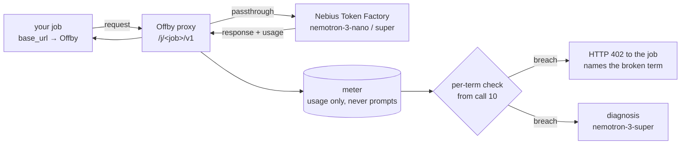

# Offby

[](../README.md) [](README.en.md)

**A forecast referee for LLM batch jobs.**

You write one sentence about the job you are about to run. Offby turns it into five measurable terms, watches the job through an OpenAI-compatible proxy, and — if the numbers drift from what you said — stops the job around the tenth call and **names the assumption that broke**. Not after the budget is gone.

> **Status: design → build.** Entry for the [Nebius × NVIDIA Global AI Hackathon](https://nebiusglobalaihackathon.devpost.com/) (submissions close 2026-10-30). This README is the contract; code lands weekly. Nothing below is shipped until its roadmap checkbox is ticked.

---

## The problem, in one table

A budget cap counts money. Money is the last thing to move.

You post in Slack: *"200k-row classification pass tonight on nemotron-nano, short prompts, paragraph answers, under $20."* You are assuming ~250 output tokens per call. The model reasons before it answers, so you actually get ~2,150 — 8.6× your assumption.

| | Stops at call | Money gone | What you learn |
|---|---|---|---|
| Budget cap, model not in its price table | never (200,000) | ~$107 | nothing — cost was recorded as $0 |
| Budget cap, price configured, cap = $20 | ~37,000 | $20 | "Current cost: 20.0, Max budget: 20" |
| **Offby** | **10** (halts at 25) | **~$0.01** | "`output_tokens` 8.6× forecast · 87% of completion tokens are reasoning · thinking is on by default → set `enable_thinking: false`, projected $18.9" |

Numbers are illustrative; Nemotron-3-Nano prices as listed on Nebius Token Factory. See [Why not just a budget cap?](#why-not-just-a-budget-cap)

## How it works



**1. One sentence → five terms.** `nemotron-3-nano-30b` parses your forecast into `calls`, `input_tokens/call`, `output_tokens/call`, `unit price`, `window`. Anything you did not state is badged `ASSUMED`. Prices for Token Factory models come live from `GET /v1/models?verbose=true`; a model Offby cannot price is `UNPRICED` and shown as the top finding — never $0. You confirm the five terms before anything is enforced.

```json
{"job":"j_7f3a","budget_usd":20,
 "terms":{
  "calls":         {"value":200000,"source":"stated"},
  "input_tokens":  {"value":400,   "source":"assumed","why":"short prompts"},
  "output_tokens": {"value":250,   "source":"assumed","why":"paragraph answers"},
  "price":         {"in_per_m":0.06,"out_per_m":0.24,"source":"oracle"},
  "window":        {"end":"tonight","source":"stated"}}}
```

**2. Point the job at Offby.** One environment variable. No SDK, no code change.

```bash
OPENAI_BASE_URL=http://localhost:8402/j/j_7f3a/v1 python classify.py
```

**3. Referee from call 10.** For every term Offby compares the observed rate to your forecast and projects the total. A term is breached only when *both* the running mean and the last-5-call mean exceed the threshold (default 2×), so one long answer does not kill a job. On breach the job receives a real error it cannot ignore:

```http
HTTP/1.1 402 Payment Required
X-Offby-Halt: output_tokens
X-Offby-Diagnosis: /j/j_7f3a/diagnosis

{"error":{"type":"offby_term_breach","term":"output_tokens","ratio":8.6,
 "message":"term output_tokens breached 8.6x (250→2150) — halted at 25/200000; projected $103.2 vs $12.0",
 "resume":"offby accept j_7f3a output_tokens=2200"}}
```

**4. Diagnosis, only on breach.** `nemotron-3-super-120b` reads an evidence bundle — reasoning-token share (`usage.completion_tokens_details.reasoning_tokens`), retries and 429s, cached-input share, service tier, any model you never mentioned — and streams the mechanism, the top unknown-unknown, and a corrected forecast. You either `accept` the new number or fix the cause and rerun.

## A job, start to finish

**22:10** A on the data team posts in Slack: *"200k-row classification pass tonight on nemotron-nano, short prompts, paragraph answers, under $20."*

**22:11** She pastes the sentence as-is.

```
$ offby forecast "200k-row classification pass tonight on nemotron-nano, short prompts, paragraph answers, under $20" --budget 20

  term             forecast     source
  calls            200,000      stated
  input tok/call   400          ASSUMED ← "short prompts"
  output tok/call  250          ASSUMED ← "paragraph answers"
  price $/M        0.06 / 0.24  token factory (live)
  window           tonight      stated
  projected        $16.80       (< $20 ✓)

  2 terms are Offby's guesses. Enter to accept, or edit:  ↵
  job j_7f3a created. base_url → http://localhost:8402/j/j_7f3a/v1
```

250 sounds right to her; Enter. **One model call so far** (sentence → five terms).

**22:12** One environment variable on the existing script.

```
$ OPENAI_BASE_URL=http://localhost:8402/j/j_7f3a/v1 python classify.py
```

**22:12:40** The proxy records the `usage` object that rides on every response. Ten calls in:

| call | prompt | completion | of which reasoning |
|---|---|---|---|
| 1 | 402 | 2,180 | 1,905 |
| 2 | 398 | 2,090 | 1,820 |
| … | … | … | … |
| 10 | 411 | 2,150 | 1,870 |

Verdict (arithmetic only): mean output 2,137 ÷ forecast 250 = **8.5×**; last-5 mean 2,140 ÷ 250 = **8.6×** — both over the 2× threshold → **breach**. Calls, input (mean 405) and price are on plan. The broken term is `output_tokens`, alone. Projection: $0.005 spent, **$107.6** if nothing changes.

**22:13** The 25th request gets a 402. Her terminal:

```
openai.APIStatusError: 402 offby: term output_tokens breached 8.6x (250→2150)
  — halted at 25/200000; projected $107.6 vs $16.80.
  resume: offby accept j_7f3a output_tokens=2200   diagnosis: http://localhost:8402/j/j_7f3a
```

**22:13** The diagnosis panel (second model call, `nemotron-3-super`):

> Broken term: **output**. 87% of completion tokens are reasoning (`usage.completion_tokens_details.reasoning_tokens`). `nemotron-3-nano` thinks by default — you priced a paragraph; it billed a trace plus a paragraph. Calls, input and price are on plan. **Fix**: `chat_template_kwargs.enable_thinking=false` → ~290 output tokens/call, projected **$18.9**.

**22:15** She adds the flag and reruns. Gauges go green past call 60. The job finishes at 3 a.m.; the bill is $18.7.

**The same night without Offby**
- No cap → a **$107** invoice in the morning, and a log to dig through to learn why it was 6× off.
- `max_budget=20` on a LiteLLM key → around 1 a.m., at call **~37,000**: `Budget has been exceeded! Current cost: 20.0, Max budget: 20`. 19% processed, $20 gone, and the same settings fail the same way on rerun. If nemotron-3 is missing from LiteLLM's price table the cap **never fires** (cost recorded as $0).
- Cap on a shared team key → her job drains **the whole team's budget** overnight and other people's requests start failing.

Offby did one thing: **compared the numbers you said to the numbers observed, term by term, and named the one that was wrong before the money left.**

### Without a forecast — baseline mode

Too lazy to write the sentence? `offby serve --baseline 10` uses the first ten calls as the baseline and only flags sudden shifts (2× per term). It cannot say "this differs from what you expected", but it will say "output tripled from call 50".

## What the models do here

| | Role | Why this one |
|---|---|---|
| `nvidia/nemotron-3-nano-30b` | Parse a casual sentence into five typed terms with `ASSUMED` flags (structured output) | Cheap, fast, and the only step where natural language is irreducible |
| `nvidia/nemotron-3-super-120b` | Diagnose a breach from the evidence bundle; write the corrected forecast | Runs once per breach, not per call |
| Nebius Token Factory | Live price oracle (`/v1/models?verbose=true`), the `usage` object incl. reasoning and cached tokens, rate-limit headers | The metering surface *is* the sponsor API |

**There are zero model calls in the hot path.** The proxy reads the `usage` object that already rides on every response. Models are called exactly twice per job: once to parse the forecast, once per breach to explain it.

## Why not just a budget cap?

You should have a budget cap. Offby is not a replacement for one — it sits beside it.

| | LiteLLM / gateway budgets | Offby |
|---|---|---|
| Unit of detection | dollars accumulated | rate vs. **your** forecast, per term |
| Earliest stop | when the budget is spent (and only if the model is in the price table) | call 10 |
| What the error says | current spend vs. max | which term broke, by how much, and why |
| Needs | database, keys per job/team | one environment variable |
| Stores | spend logs / request logs | `usage` only — never prompts or completions |

Verified against the LiteLLM docs and source on 2026-09-06: budget enforcement is a pre-call check of accumulated spend (with optimistic reservation on recent versions); the breach message names the entity, current cost and max budget; the bundled price map had no Nemotron 3 entry, so cost for those models is recorded as `None` unless you add custom pricing. `soft_budget` alerts include a projection but never block. Offby's job is the part a cap structurally cannot do: **stop early, and say which assumption was wrong.** A LiteLLM plugin mode (`CustomLogger` pre-call hook) is on the roadmap so teams that already run a gateway get the referee without a second proxy.

## Design rules

- **Usage only.** The meter stores token counts, model id, status, latency, retry and rate-limit headers. Prompts and completions are never written.
- **Never $0.** A model without a price is `UNPRICED` and shown first, not silently zero.
- **Assumptions are visible and confirmed.** Every unstated term is `ASSUMED` with the phrase it came from, and the five terms are shown before enforcement starts.
- **No verdict before 10 calls; two means must agree.** Long-tail outputs do not trigger a halt.
- **Offby's 402 is not the upstream's 402.** Token Factory returns 402 when *your* balance is exhausted; Offby's carries `type: offby_term_breach` and `X-Offby-Halt` so the two are never confused.
- **Fail open on request.** `--fail-open` passes traffic through if the meter itself is down; the referee must never be the thing that kills a healthy job.
- **Reasoning tokens are unknown until observed.** If `completion_tokens_details` is null, Offby estimates from `reasoning_content` or `<think>` tags and labels the estimate; it never coerces null to 0.

## Planned CLI

```bash
offby serve   --upstream https://api.tokenfactory.nebius.com/v1     # the proxy
offby forecast "200k-row classification tonight on nemotron-nano, short prompts, paragraph answers, under $20" --budget 20
offby report  j_7f3a                                                 # per-term forecast vs observed, cost, diagnosis
offby accept  j_7f3a output_tokens=2200                              # accept one term, resume
offby serve   --baseline 10                                          # no forecast: first 10 calls set the baseline, flag sudden shifts
```

## Roadmap

- [ ] **Week 1** — proxy + meter + price oracle end to end; day-1 measurements on Token Factory (canonical model ids, is `reasoning_tokens` populated, which flag turns thinking off, does `json_schema` hold on nano)
- [ ] **Week 2** — breach engine, 402 body, `accept`, CLI, report
- [ ] **Week 3** — forecast parser with fallback chain (`json_schema` → `guided_json` → `json_object` + repair); streamed diagnosis
- [ ] **Week 4** — single-page UI: forecast card, gauges, terminal log, diagnosis panel, receipts drawer
- [ ] **Week 5** — hosted demo: three server-side prompt sets that break *different* terms, run queue, per-IP quota, daily spend ceiling, honest replay fallback
- [ ] **Week 6** — LiteLLM plugin mode, README from clean clone, 3-minute video, tooling feedback
- [ ] **Submit by Oct 28**

## Not built, by design

Cutting a stream mid-response (verdicts happen at request boundaries) · multi-process / Redis counters · user accounts and key issuance · Batch API and cache-discount accounting (recorded as evidence, not priced) · prompt storage or replay queues · a frontend build step · upstreams other than OpenAI-compatible endpoints · automatic `accept`.

## Hackathon

Track: **Best Apps and Agents**. Requirements this repo will satisfy: runtime calls to Nebius Token Factory · NVIDIA Nemotron 3 models load-bearing (parse + diagnose) · public repository under Apache-2.0 · hosted demo URL · video under three minutes · tooling feedback.

## License

Apache-2.0. See [LICENSE](../LICENSE).
