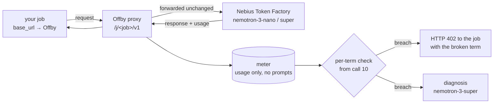

# Offby

[](../README.md) [](README.en.md)

**Forecast referee for LLM batch jobs.**

Before you run, you say what you expect. Offby watches the job and, the moment the numbers disagree with you — at about the tenth call, not after the budget is gone — it halts the job and **names the assumption that broke.**

> **Status: PoC runs against a mock upstream and a local 4B.** Token Factory measurements not yet done. Entry for the [Nebius × NVIDIA Global AI Hackathon](https://nebiusglobalaihackathon.devpost.com/), deadline 2026-10-30. Nothing is shipped until the roadmap boxes are ticked. What exists and what is verified, plainly: [STATUS.md](STATUS.md) (Korean).

---

## The 30-second version

You get in a taxi and say "about twenty bucks, right?" At the third kilometre the meter says *"at this pace it's ninety — and what's off isn't the distance, it's the **toll**"* and pulls over. That is Offby.

Budget caps count money. Money is the slowest number to move.

You wrote in Slack: *"200k-row classification tonight on nemotron-nano, short prompts, paragraph answers, under $20."* You assumed ~250 output tokens per call. The model reasons before it answers, so it is ~2,150 — 8.6× your assumption.

| | Stops at call | Money gone | What you learn |
|---|---|---|---|
| Budget cap, model not in the price table | never (200,000) | ~$107 | nothing — cost recorded as `None`/$0 |
| Budget cap, price registered, cap = $20 | ~37,000 | $20 | "Current cost: 20.0, Max budget: 20" |
| **Offby** | **10** | **~$0.01** | "`output_tokens` at 8.6× forecast · 87% of completion tokens are reasoning · with `enable_thinking: false` projected $18.9" |

Illustrative numbers; prices as published by Nebius Token Factory for Nemotron-3-Nano.

**Offby is not a tool for spending less; it is a tool for batches that finish as planned.** The fixed run above still spends $18.7 — money that would otherwise have gone overrun → killed halfway → refund request → next batch somewhere else. That is why vendors build caps themselves (OpenAI 2026-07 "one of the most requested features", Google 2026-03, Cloudflare 2026-06): predictable spend is what puts batches on a platform.

**Token Factory today (surveyed 2026-09-09):** no spend cap (the `billing threshold` triggers an auto-charge, [billing](https://docs.tokenfactory.nebius.com/other-capabilities/billing-new.md)) · no alerts · per-key usage "In Review" for over a year on the [ideas board](https://ideas.nebius.com/p/usage-per-api-key-in-ai-studio) · the [observability page](https://docs.tokenfactory.nebius.com/ai-models-inference/observability.md) says it is "not billing reconciliation" · [rate limits](https://docs.tokenfactory.nebius.com/ai-models-inference/rate-limits.md) auto-raise 20% every 15 minutes. For Token Factory users Offby is not a finer layer but the only one — which is why a per-key cap feature request goes in alongside it.

## Three ways in

**1. Agent skill (recommended).** Batch code is mostly written by agents now. Drop [`skills/offby/SKILL.md`](../skills/offby/SKILL.md) into a harness like Claude Code and, right before the agent runs an LLM loop, the skill fires: **derive the forecast from the code → register the job → run through the proxy → on 402, read the diagnosis, fix the code, rerun.** Nobody types a forecast. The agent reads N, the prompt template and the model id from its own code, which beats guessing from a sentence.

**2. CLI.** Create a named job and get a URL.
```bash
offby job ensure nightly-classify --calls 200000 --input 400 --output 250 --model nvidia/nemotron-3-nano-30b-a3b --budget 20
OPENAI_BASE_URL=http://localhost:8402/j/nightly-classify/v1 python classify.py
```
Prefer a sentence? `offby forecast "200k rows tonight on nemotron-nano, short prompts, paragraph answers, under $20"` — nano turns it into five terms and badges anything you didn't state as `ASSUMED`, to confirm before anything runs.

**3. cron / containers.** Run the proxy as a sidecar next to the job; one URL in the command line. Same name again = a new run.

All three change exactly **one environment variable** on the job side. No SDK, no code change, no new key. The job's own API key passes straight through.

## How it works



1. **Forecast → five terms.** `calls · input tok/call · output tok/call · unit price · window`. Prices come live from `GET /v1/models?verbose=true`; an unknown model shows as `UNPRICED` at the top — never as $0.
2. **Point the job at Offby.** One env var. Request bodies are forwarded untouched.
3. **Referee from the 10th valid call.** Every response carries `usage`; per term, the ratio observed ÷ forecast accumulates. A term breaches only when the mean ratio over the judged window **or** over the last 30 calls exceeds the threshold (default 2×) **with confidence, t > 2.5** — real output lengths are heavy-tailed (p95 ≈ 3.6× the median), and one long answer never kills a job (0% in simulation). Error responses and usage-less responses never enter a mean; they are tallied separately. On breach, the next request gets a real error:

```http
HTTP/1.1 402 Payment Required
X-Offby-Halt: output_tokens
X-Offby-Diagnosis: http://localhost:8402/j/nightly-classify/diagnosis

{"error":{"type":"offby_term_breach","term":"output_tokens","ratio":8.6,
 "message":"offby_term_breach: term output_tokens breached 8.6x (250→2150, t=4.1) — halted at 25/200,000 (judged at 10, 15 were in flight); projected $103.20 vs $16.80",
 "resume":"offby accept nightly-classify output_tokens=2150","errors":{"429":2},"unmetered":0}}
```

4. **Diagnosis only on breach.** `nemotron-3-super` reads the evidence bundle (reasoning-token share, retries/429s, cached-input share, a model you never mentioned) and returns **mechanism · top unknown · fix**. Fix the cause and rerun (`offby accept <job>`), or accept the new number (`offby accept <job> output_tokens=2200`).

**Zero model calls on the hot path.** Two per job at most: one parse (only if you wrote a sentence), one diagnosis per breach.

Referee numbers (lognormal simulation shaped like real reasoning output, calling `judge.py` directly): healthy jobs false-halt **0%** (spike rate up to 2%), 0% when the forecast is the mean, a single 4,000-token answer anywhere from n=10 to 30 halts **0%**; an 8× overrun is caught at call 10, **8× after 1,000 healthy calls in 11 calls** (the old overall-mean rule needed 286), 2.5× in 24, a 30%-of-items-10× bimodal in 33, a 1→3× drift in 128.

## Vocabulary — job, call, run

- **call** = one HTTP request. One row in `calls`.
- **job** = every call that arrived under one URL (`/j/<name>/v1`), sharing one forecast. It is a SQLite row and a path segment — not a process, not a queue.
- **run** = one execution, started each time you call `offby job ensure <name>` again. Counters, verdict and state reset; history is kept.
- **The job does not know Offby exists.** It only sees a base_url. The proxy cannot kill the job's process; it returns 402, the SDK raises, the job stops on its own exception. A job that keeps calling anyway keeps getting 402 — and a halted job never reaches the upstream, so no money moves.

## Where it fits, where it doesn't

One assumption underneath everything: **tokens per call are roughly constant.** That is what makes "observed ÷ forecast, per call" meaningful.

| Situation | Fit | Why |
|---|---|---|
| 200k reviews to classify, nightly embeddings, eval sweeps, document OCR, synthetic data | **yes** | same template × N rows |
| An agent routine on cron, every day | **yes** | same name = new run; history becomes the forecast (roadmap) |
| An agent fleet processing 5,000 tickets the same way | **yes** | repetitive shape |
| One ReAct-style agent loop | so-so | unknown call count; context grows every turn so `input_tokens` legitimately multiplies. Use `--baseline` to catch sudden change only |
| Interactive sessions someone is watching, chatbot serving traffic | **no** | no forecast, no shape, no end; a human is already in the loop. That is the gateway's per-key budget territory |
| An upstream that ignores `stream_options.include_usage` | **partly** | tokens are estimated from the streamed text (and flagged); five usage-less responses in a row halt with `X-Offby-Halt: usage` — never a silent pass |

Offby is for **runs nobody is watching.** Put it in front of a run someone is watching and it is not a referee, it is a nuisance.

## A job, start to finish

**22:10** A on the data team: *"Classifying 200k reviews tonight on nemotron-nano. Short prompts, one-paragraph answers, should be under $20."*

**22:11** Paste the sentence.

```
$ offby forecast "200k reviews tonight on nemotron-nano, short prompts, paragraph answers, under $20" --budget 20

  term             forecast     source
  calls            200,000      stated
  input tok/call   400          ASSUMED ← "short prompts"
  output tok/call  250          ASSUMED ← "paragraph answers"
  price $/M        0.06 / 0.24  token factory (live)
  window           tonight      stated
  expected total   $16.80       (< $20 ✓)

  2 ASSUMED terms are Offby's guesses. Enter to accept, or type fixes:  ↵
  job j_7f3a created. base_url → http://localhost:8402/j/j_7f3a/v1
```

**22:12** One env var. `OPENAI_BASE_URL=http://localhost:8402/j/j_7f3a/v1 python classify.py`

**22:12:40** Ten valid calls in. Output mean 2,137 ÷ forecast 250 = **8.5×**, and steadily so (t = 4.1 > 2.5) → breach. Calls, input, price on plan. Broken term: `output_tokens`. Spent so far $0.005; at this pace **$107.6**.

**22:13** The next request gets 402. A's terminal:

```
openai.APIStatusError: 402 offby: offby_term_breach: term output_tokens breached 8.6x (250→2150, t=4.1)
  — halted at 25/200,000 (judged at 10, 15 were in flight); projected $107.60 vs $16.80
  resume: offby accept j_7f3a output_tokens=2150   diagnosis: http://localhost:8402/j/j_7f3a/diagnosis
```

**22:13** Diagnosis (`nemotron-3-super`):

> Broken term: **output**. 87% of completion tokens are reasoning. `nemotron-3-nano` thinks by default — you priced a paragraph, it billed a trace plus a paragraph. **Fix**: `chat_template_kwargs.enable_thinking=false` → ~290 output/call, projected **$18.9**.

**22:15** A adds the flag, runs `offby accept j_7f3a`, reruns. Green from call 60. Done at 3 a.m., billed $18.7.

**Same night without Offby** — no cap: a $107 invoice in the morning. LiteLLM key with `max_budget=20`: stops at call ~37,000 around 1 a.m., 19% processed, $20 gone, same failure on the next run. Cap on a shared team key: A's job burns the whole team's budget and other people's requests get refused.

### Without a forecast — baseline mode

`offby job ensure <name> --baseline 10`. The first ten calls become the reference; only sudden change (2× per term) is caught afterwards. It cannot say "this differs from what you expected", but it can say "output tripled from call 50".

## Try it now (PoC)

No key, no spend. The mock upstream answers like Nemotron — **thinking on by default** — and its defaults look like reality: lognormal output lengths (σ 0.8), ~1 s ± 50% per call, `finish_reason: length` when `max_tokens` cuts an answer. `--profile hostile` adds 10% 429/500s, reasoning delivered as `reasoning_content`, canonical model ids, and per-token price strings. Model ids start with `mock/` so `lessons` never mistakes them for measurements. `--latency-ms 0` for speed.

```bash
uv sync                                                              # Python 3.12, .venv
uv run offby mock  --port 8499                                       # terminal 1: fake Token Factory
uv run offby serve --port 8402 --upstream http://127.0.0.1:8499/v1   # terminal 2: the proxy
```

Terminal 3 — a sample job that classifies `examples/reviews.jsonl` (120 rows):

```bash
uv run offby job ensure classify-reviews --calls 120 --input 40 --output 250 \
  --model nvidia/nemotron-3-nano-30b-a3b --budget 1 --upstream http://127.0.0.1:8499/v1 -y
#   expected total $0.01 · base_url → http://localhost:8402/j/classify-reviews/v1

OPENAI_BASE_URL=http://localhost:8402/j/classify-reviews/v1 uv run python examples/classify.py --data examples/reviews.jsonl
#   after 10 valid calls: 402 offby: offby_term_breach: term output_tokens breached 8.9x (250→2234, t=4.1)
#                         — halted at 10/120; projected $0.0646 vs $0.0075     (numbers vary a little each run — heavy tail)

uv run offby report classify-reviews       # per-term table · evidence (reasoning 87%) · diagnosis · resume command
uv run offby accept classify-reviews       # cause fixed → judge again from the next call
OPENAI_BASE_URL=http://localhost:8402/j/classify-reviews/v1 uv run python examples/classify.py --data examples/reviews.jsonl --no-think
#   enable_thinking=false → ≈290 output → 120/120 pass

uv run offby lessons                       # this model's thinking multiplies output ≈7× — use it in the next forecast
uv run offby job ensure classify-reviews -y   # tomorrow: same name = new run, forecast kept
```

A sentence forecast works against the mock too (it answers the parse prompt): `uv run offby forecast "classify 120 reviews tonight on nemotron-nano, short prompts, paragraph answers, under $1" --budget 1 --upstream http://127.0.0.1:8499/v1 --api-key mock`. For hostile conditions start `uv run offby mock --port 8499 --profile hostile` and repeat the flow — `report` grows lines like `failed calls: 4 (429)` and `reasoning share 87% (estimated)`.

To run the same flow as an agent skill, put `skills/offby/SKILL.md` in your harness's skill folder (Claude Code: `.claude/skills/offby`). For the real Token Factory, set `NEBIUS_API_KEY` and drop `--upstream`. The meter keeps only usage numbers in `~/.offby/offby.sqlite` (or `$OFFBY_DB`).

**Built** — proxy (non-streaming and streaming; meters chat/completions, completions, embeddings, responses) · usage meter (SQLite, with `finish_reason`) · price oracle (unit table for `/v1/models`; `"0"`, absent and ambiguous tails are `UNPRICED`) · breach engine (10 valid calls · 2× · t > 2.5 over the judged window OR the last 30) · errors / usage-less / estimated tallied apart · five usage-less in a row → `X-Offby-Halt: usage` · 402 body/headers (`X-Should-Retry: false`) · named jobs and runs (`job ensure`) · `accept` / `report` / `lessons` / `jobs` · baseline mode (median) · nano forecast parsing · super diagnosis (empty answers are `unavailable`) · realistic mock (tail, latency, errors, 4 reasoning shapes, 4 pricing shapes, `--profile hostile`) · agent skill · 43 tests.
**Not yet** — Token Factory day-1 measurements (canonical model ids, whether `reasoning_tokens` is populated, which flag disables thinking, the real shape of the verbose price listing) · `alert` mode (webhook/log, never 402) · webhook · sticky halt and an enforced budget (`job ensure` can walk around a halt today) · O(1) judging (today every call re-scores the whole run) · multi-proxy safety · HTTP control plane · history-based auto-forecast · streaming diagnosis · UI · LiteLLM plugin.

## Where the models carry weight

| | Role | Why this model |
|---|---|---|
| `nvidia/nemotron-3-nano-30b` | Casual sentence → five `ASSUMED`-badged terms (structured output) | cheap, fast, and the only step where natural language is unavoidable |
| `nvidia/nemotron-3-super-120b` | Diagnose the breach from the evidence bundle; propose a corrected forecast | once per breach, not per call |
| Nebius Token Factory | live prices, `usage` with reasoning and cached tokens, rate-limit headers | the measurement surface *is* the sponsor API |

Nemotron 3 ships the knob (`enable_thinking`, reasoning-budget control) that makes the same prompt 3-4× cheaper. Offby is what tells you, within the first ten calls, that you forgot to turn it — and the number `lessons` keeps ("thinking multiplies this model's output 4.3×") is how to use the model well, not a complaint about it. The demo overrun is measured, not staged.

**First measurement (2026-09-09, local `nemotron-3-nano:4b` Q4 via Ollama, 120 reviews classified, $0):** the official chat template defaults `enable_thinking` to True. Thinking on: completion median 144 · mean 217 · p95 559 · max 848 (85% reasoning, lognormal σ≈0.6); thinking off (`reasoning_effort: none`): 67 → **3.2× (mean)**. The "8.6×" in the table above is an illustration for the 30B with long answers; the real multiplier depends on model and prompt. Ollama puts no `reasoning_tokens` in usage (Offby estimated from the `reasoning` field), ignores `chat_template_kwargs` and reads `reasoning_effort` — the off switch differs per server. A run on the same 4B with output mis-forecast at 60 was halted at **4.7× after 42 calls** (what t > 2.5 confidence costs on a heavy tail; $0.003 spent by then). The 4B was not enough for diagnosis (it blamed latency and missed the 88% reasoning share) or sentence parsing (120 reviews → calls=1).

**Same day, local `nemotron-3-nano:30b` (Q4, 24 GB, ~50 tok/s):** thinking on: median 205 · mean 404 · p95 2,092 · max 4,000 (the cap) — a far heavier tail than the 4B (σ≈0.9); 1.6× the forecast of 250, so **no halt (correct)**. Thinking off: 89 → **4.3× (mean)**. The output-60 mis-forecast was **halted at call 11** (3.1×, t=2.6, $0.0006 spent). The 30B parsed **all five terms of the sentence correctly** (the 4B failed), and once the evidence carried arithmetic-derived `hypotheses` its diagnosis named the mechanism — "96% of billed tokens are a reasoning trace → `reasoning_effort='none'`" (before that it echoed the forecast back). The Token Factory 30B measurement is still pending.

## Why not just a budget cap?

Keep the cap. Offby does not replace it — it stands **next to it.** If the cap is the sprinkler, Offby is the smoke detector.

Per-run dollar ceilings already exist — [Cloudflare AI Gateway spend limits](https://developers.cloudflare.com/ai-gateway/features/spend-limits/) (2026-06, split by metadata, 429), [LiteLLM `max_budget_per_session`](https://docs.litellm.ai/docs/a2a_iteration_budgets) (429), per-key limits on [OpenRouter](https://openrouter.ai/docs/api_reference/limits) and [Vercel](https://vercel.com/changelog/budgets-for-api-keys-on-ai-gateway). Offby is the layer on top of them.

| | Gateway ceiling (Cloudflare · LiteLLM session · per-key limit) | Offby |
|---|---|---|
| Basis | an operator-set dollar ceiling — sized at or above the expected cost, so it fires after **~100% of the intended spend** | rate vs **your forecast**, per term — measured halts at 8–35% of the run (calls 11–42) |
| The error says | "Current cost: 20.0, Max budget: 20" | `output_tokens 3.1x (60→185, t=2.6)` plus a diagnosis |
| Model not in the price table | cost `None`/$0 → the ceiling never fires | shown as `UNPRICED` on the first line; token terms are still judged |
| Identity | a key (who spent) | a URL path (is this run on plan) |
| Stores | spend / request logs | `usage` only — never prompts or completions |

The honest gap: different in kind, small in code — LiteLLM already has the hooks, a session counter and a projection function, so this layer fits in one CustomLogger. That is why plugin mode is week 3 on the roadmap.

Checked against LiteLLM docs and source on 2026-09-06: enforcement is a pre-call check on cumulative spend, the exceeded message names only entity, current cost and limit, and the bundled price table has no Nemotron 3 entry, so cost is `None` unless you register a price. A 2026-09-09 survey (12 providers, 10 gateways, batch platforms, FinOps) found nobody taking a per-run forecast, testing it per term and naming the cause — and no cap or alert at all on Token Factory.

## Design rules

- **Usage only.** Token counts, model id, status, latency, rate-limit headers. There is no column for prompts or completions.
- **Never $0.** An unpriced model shows as `UNPRICED` on the first line. It never silently becomes zero.
- **Assumptions visible, confirmed before enforcement.** Every unstated term gets `ASSUMED` and its cue.
- **No verdict before 10 valid calls, and crossing the line is not enough — it must be confident.** The mean ratio has to exceed the threshold with t > 2.5 (over the judged window or the last 30 calls). Real outputs are heavy-tailed; the plain-mean rule killed 36-49% of healthy jobs. One long-tail answer never halts a job, at any point.
- **Errors and usage-less responses are not calls.** 429/5xx enter neither a mean nor the `calls` term; they are shown as `failed calls`. A 2xx without usage is estimated from the streamed text (and flagged), and five in a row halt on the `usage` term — an upstream the referee cannot see is never silently passed.
- **Resume resets the judging window.** After `accept`, only later calls are judged; otherwise a polluted mean halts the job again on the first call after the fix. Spend and projection still count the whole run.
- **402 starts with the request *after* the breach.** The response that spent the money is returned as-is. Concurrency lets that many more through, and the 402 message says so: "judged at 10, 7 were in flight".
- **Offby's 402 is not the upstream's 402.** Token Factory returns 402 when *your* balance is exhausted. Offby's carries `type: offby_term_breach` and `X-Offby-Halt`; they never mix.
- **Fail-open if you want it.** `--fail-open` passes traffic through if the meter itself dies. A referee must never kill a healthy job.
- **Reasoning tokens are unknown until observed.** If `completion_tokens_details` is null, estimate from `reasoning_content` or `<think>` tags and mark it as an estimate.

## CLI

```bash
offby serve    --upstream https://api.tokenfactory.nebius.com/v1 [--fail-open]   # the proxy
offby mock     --port 8499 [--profile hostile] [--latency-ms 0] [--tail-on 0.8]    # fake upstream (PoC)
offby job ensure <name> --calls N --input I --output O --model <id> --budget B     # named job · again = new run
offby job ensure <name> --baseline 10                                             # no forecast
offby forecast "200k-row classification tonight on nemotron-nano, …" --budget 20  # one-off job, sentence parsing
offby report   <name>                                                             # forecast vs observed per term, cost, diagnosis
offby accept   <name> [output_tokens=2200]                                        # accept a term, or resume after fixing the cause
offby lessons                                                                     # cross-job lessons — read before the next forecast
offby jobs
```

## Roadmap

- [x] **Week 1** — proxy + meter + price oracle end to end (mock upstream)
- [ ] **Week 1** — Token Factory day-1 measurements (canonical model ids, whether `reasoning_tokens` is populated, which flag disables thinking, whether nano holds `json_schema`)
- [x] **Week 2** — breach engine, 402 body, `accept`, CLI, report
- [x] **Week 2+** — named jobs and runs, `lessons`, agent skill
- [x] **Week 2+ (9/9 audit)** — valid-calls-only judging · t-test rule · usage-missing event · honest pricing · embeddings metered · realistic mock defaults and the `hostile` profile
- [ ] **Week 3** — `alert` mode + webhook, **LiteLLM plugin mode (CustomLogger)**, sticky halt and a budget term, Nebius feature request (per-key cap, `reasoning_tokens` in usage)
- [ ] **Week 4** — Token Factory measurement (a ≥$50 run, super think-on vs off, "what a $20 cap would have done on the same run"), O(1) judge and single-writer lock, HTTP control plane
- [ ] **Week 5** — history-based forecast, streaming diagnosis, minimal hosted demo (tour mode only). The single-page UI is deferred — every absorbed competitor had one
- [ ] **Week 6** — README verified from a clean clone, 3-minute video, tooling feedback
- [ ] **Submit 10/28**

## Not built, by design

Mid-stream cut-off (verdicts at request boundaries) · multi-process / Redis counters · user accounts or key issuance · Batch API and cache-discount accounting (recorded as evidence, not priced) · prompt storage or replay queues · a frontend build step · non-OpenAI-compatible upstreams · automatic `accept`.

## Hackathon

Track: **Best Apps and Agents**. What this repo satisfies: runtime calls to Nebius Token Factory · NVIDIA Nemotron 3 load-bearing (parsing + diagnosis) · Apache-2.0 public repo · hosted demo URL · video under 3 minutes · tooling feedback.

The story is not "we cut your bill". It is: **the layer Token Factory does not have, built for Token Factory** — a referee that lets unattended batches finish as planned, the thing that tells you within ten calls that you forgot Nemotron's thinking knob, and a per-key cap feature request filed alongside. The video demos `alert` mode: "at call 10 it said 'output 4×, thinking is on'; the user turned it off and the run finished."

## License

Apache-2.0. See [LICENSE](../LICENSE).
